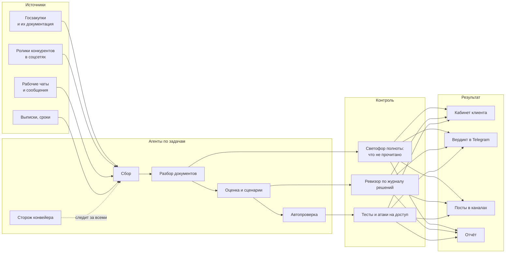

# Дмитрий Ермаков — ИИ-агенты и автоматизация

[](https://github.com/Probudyvshysya/portfolio/actions/workflows/tests.yml)

Строю системы, в которых каждую рутинную задачу ведёт свой агент: один собирает данные, другой разбирает
документы, третий пишет сценарии, четвёртый проверяет результат, пятый следит, что конвейер не встал.
Вместе они собирают одну картину — что происходит, где риск, что делать дальше, — и выдают её человеку
в кабинете, в Telegram или в отчёте. Решение остаётся за человеком.

Всё ниже работает на реальных задачах каждый день. Клиенты и данные в описаниях обезличены,
в демо — выдуманные.

**Связь:** Telegram [@official_konveyer](https://t.me/official_konveyer)



## Проекты

| | Проект | Что делает | Масштаб |
|---|---|---|---|
| 🎬 | [Reels Studio](#1-reels-studio--ведение-smm-клиентов-с-личным-кабинетом) | ведёт клиентов агентства: от залетевшего ролика конкурента до заявки, с личным кабинетом клиента | [демо](https://reels-studio-demo.vercel.app), 31 страница, 10 типов фоновых заданий |
| 📑 | [Радар госзакупок](#2-радар-госзакупок-и-агенты-проверки-документов) | каждое утро находит закупки, скачивает и читает всю документацию, выносит вердикт | 872 закупки, 938 комплектов документов |
| 🔎 | [Агенты проверки документов](agents/doc-verification) | пять агентов: полнота чтения, ссылки на нормативы, подмена в библиотеке, разметка ТЗ, ревизор | **код открыт**, 18 тестов |
| 💬 | [Telegram: каналы и боты](#3-telegram-автоведение-каналов-и-боты-по-задачам) | автопостинг по расписанию, бот-помощник с памятью, сторож рабочих чатов | без включённого компьютера |
| 🖥 | [Инфраструктура агентов](#4-инфраструктура-сервер-247-и-голосовое-управление) | свой сервер, где агенты работают круглосуточно; голосовое управление | ~2 000 ₽ в месяц |

---

## 1. Reels Studio — ведение SMM-клиентов с личным кабинетом

**Задача.** Агентство ведёт десяток клиентов. Нужно каждый день находить темы, которые уже сработали,
писать сценарии, согласовывать их с клиентом, монтировать, публиковать и показывать клиенту результат в цифрах.

**Как работает.**
1. **Сбор.** Каждое утро агент собирает ролики конкурентов в нише клиента. Instagram отдаёт закрытый API с ошибкой 429,
   поэтому сбор идёт через невидимый браузер: 22 аккаунта из 22 без ошибок (через API получался 1 из 22).
2. **Отбор.** Для каждого ролика считается **×N** — во сколько раз он обогнал обычный уровень своего автора (медиана).
   Залёт — это «много для этого автора», а не «много просмотров», поэтому находятся темы, а не большие аккаунты.
3. **Разбор.** ИИ разбирает залетевший ролик по речи и подписи: заход, раскадровка, почему сработал, идеи для каждого клиента ниши.
   Если в ролике нет ни речи, ни текста, агент честно отказывается: «такой ролик смотрят глазами».
4. **Сценарий.** Два варианта под рубрику и голос клиента: A — тема, главная мысль и факты; B — другой заход и практический совет.
5. **Согласование в кабинете клиента.** Клиент читает сценарий и смотрит исходный ролик, нажимает «Согласовать»
   или «На доработку» с комментарием. Команда получает решение сразу, без переписки.
6. **Автопроверка монтажа.** До того как ролик увидит клиент: громкость −14 LUFS, длительность, вертикаль 1080×1920,
   сверка речи с утверждённым текстом через Whisper (на реальном ролике совпадение 98 %). Слова с рискованным
   ударением выписываются отдельно — их слушает человек.
7. **Результат.** Просмотры, подписчики, заявки и договоры — по каждому клиенту и в целом, графики по дням.

**Личный кабинет клиента:** «Согласовать» · «Снять» (текст для съёмки и отправка записи) · «Готово» (ролики с описаниями
под каждую площадку) · «Итоги» (что изменилось с начала работы и лента последних изменений).

<p>
  
  
  
</p>

**Защита.** Каждая таблица под Row Level Security; клиент видит только свой проект через отдельные представления
только для чтения; монтажёр меняет только свою задачу и только поля монтажа; ролики в приватном хранилище,
ссылка живёт 5 минут и выдаётся после проверки прав; токен Instagram не возвращается в браузер.
Проверено шестью кругами атаки независимыми агентами (Claude, Qwen, DeepSeek); 32 атаки на права
повторяет автотест прямо в базе под каждой ролью.

**Стек:** Next.js 16, React 19, TypeScript, Supabase (Postgres, RLS, Auth, Storage), Python-воркеры, Vercel.
Код закрыт — боевая версия работает с клиентами. [Подробнее, скриншоты и модель безопасности →](reels-studio)

---

## 2. Радар госзакупок и агенты проверки документов

**Задача.** Каждый день выходят сотни закупок. По каждой надо прочитать комплект документов — техзадание, смету,
проект контракта — и понять: можно ли выполнить работу за эти деньги и нет ли барьера, из-за которого заявку отклонят.

**Как работает.**
1. **Сбор.** По 70 поисковым запросам из единой системы закупок, от 100 тыс. ₽; дубли убираются по реестровому номеру.
2. **Документация.** Скачиваются все файлы извещения, распаковываются zip / rar / 7z, doc и xls переводятся в текст,
   PDF читается постранично. Отдельно — печатная форма: только там обеспечение заявки и квота для малого бизнеса.
3. **Оценка.** Барьеры и плюсы по таблице баллов, вердикт: **НАША · НАША+СОФТ · СУБПОДРЯД · МИМО · НЕ ПРОВЕРЕНО**.
4. **Отчёт.** Каждое утро — подборка в Telegram: что подавать самим, что отдать на субподряд, что мимо и почему.

**Цифры за два месяца:** 872 закупки в базе, документация разобрана у 558, скачано и прочитано 938 комплектов.
Вердикты: мимо — 457, субподряд — 173, своя — 52, не проверено (сканы без текста) — 154.

**Каждый модуль вырос из конкретной аварии:**

| Что случилось | Что теперь делает система |
|---|---|
| Готовая библиотека выдала **712 символов вместо 30 262**: текст был набран таблицей, ошибок в логах не было | свои парсеры Word с таблицами и сносками; полнота чтения проверяется на эталонных документах |
| Вывод «барьеров нет» сделан по половине комплекта: PDF читался до 25-й страницы | **светофор полноты**: считает то, что *не* прочитано; при красном решение не принимается |
| Сбор **молча стоял пять суток**: расписание отрабатывало, логи писались, данных не было | **сторож конвейера** отличает «данных нет» от «конвейер сломан» и краснеет сам |
| Площадка после 250 запросов в час отдаёт заглушку с кодом 200 — сбор «исправен» и находит 0 | заглушка распознаётся, и вместо ложного «новых закупок нет» приходит сообщение о блокировке |
| Без IT-запросов радар не видел **219** живых закупок | добавлены IT-запросы — их стало 70; пропуски видны в журнале решений |
| Глубину снижения цены на торгах узнавали после подачи | **журнал решений**: прогноз пишется до подачи, факт — после; ревизор раз в месяц находит смещение по сегменту |

Двенадцать агентов параллельно построчно прочитали 31 комплект и вычеркнули 22 закупки с причиной по каждой.
Перекрёстная проверка вторым агентом дважды перевернула вердикт первого — с тех пор она обязательна.

**Открытый код:** [agents/doc-verification](agents/doc-verification) — вычищенное ядро проверки документов:
светофор полноты, сверка ссылок на пункты нормативов, аудит библиотеки нормативов (подмена и устаревшая редакция),
разметка пунктов ТЗ «наше / не наше / от заказчика», журнал решений с ревизором. Запускается одной командой,
18 тестов, примеры на вымышленных нормативах.

```text
$ python -m dva gate examples/kit
🔴 КРАСНЫЙ: документов 2, проблемных 1
  НЕ ПРОЧИТАН smeta_scan.pdf — PDF без текстового слоя (скан): 1 стр. — нужно распознавание
Решение принимать нельзя: комплект неполный.

$ python -m dva norms --registry examples/registry.json --library examples/library
  🔴 ПОДМЕНА СП 90002.2023 — нет слов из названия: организации дорожного движения — внутри другой документ
  🟠 УСТАРЕЛО ОДМ 90003-2022 — нет изменений актуальной редакции: Изменение № 2
```

---

## 3. Telegram: автоведение каналов и боты по задачам

**Автопостинг канала.** Посты лежат в очереди; публикация идёт по расписанию через GitHub Actions — компьютер не нужен.
Запуск в три окна на случай пропуска расписания, повторный запуск ничего не дублирует. Пост длиннее лимита подписи
(1 024 знака) не обрезается молча, а останавливается с ошибкой. Опубликовано 40 постов без ручного участия.

**Бот-помощник для команды.** Сообщение в бот уходит агенту вместе с последними 40 репликами разговора и файлом
фактов по проекту: агент отвечает по делу, а не с чистого листа. Голосовые расшифровываются (Whisper), скриншоты
агент открывает сам. Новое правило или решение из разговора он дописывает в память. Задачи, для которых нужен
браузер, ставит в очередь компьютеру. Устроен как служба на сервере: поднимается сам после перезагрузки.

**Сторож рабочих чатов.** Раз в 30 минут читает выбранные чаты (только чтение), модель отделяет правки
и поручения от болтовни, в бот приходит короткая выжимка: кто, что и к какому сроку просит.

**Агент учёта.** Разбирает банковские выписки. В PDF одного из банков нет таблицы, поэтому колонки определяются
по координатам текста. Делит поступления на «доход / не доход» и напоминает о сроках платежей за 14, 7, 3 и 1 день.

**Защита.** Токены не печатаются в вывод; бот отказывается отправлять файлы `.env`, ключи и всё, в имени чего есть
token или secret; рабочие и личные сообщения разведены по разным ботам.

---

## 4. Инфраструктура: сервер 24/7 и голосовое управление

**Сервер для агентов.** Арендованный Linux-сервер, на котором агенты работают круглосуточно, без включённого
компьютера: сессия в tmux, служба systemd поднимает её после перезагрузки, задачи по cron. Управление — по SSH
с компьютера или телефона и через Telegram.
Защита: вход только по ключу, без пароля и root; файрвол и fail2ban; после попытки перебора SSH перенесён
с порта 22; доступ к компьютеру — обратный туннель, который слушает только локальный адрес, требует токен
и пишет каждый запрос в журнал; секреты — в файле с правами 600.

**Голосовой пульт.** Говоришь «Клод, …» — команда уходит агенту, ответ звучит вслух. Распознавание локальное:
маленькая модель ловит слово-активатор, точная распознаёт фразу. Речь без активатора никуда не уходит и не пишется
в журнал. Офлайн-голос со словарём ударений, команды «стоп», «повтори», «пауза» без обращения к модели.

---

## Как я работаю с агентами

- **Каждой задаче — свой агент с понятной ролью:** исполнитель, проверяющий, ревизор, атакующий. Агент, который сделал
  работу, не принимает её сам.
- **Объёмную рутину отдаю второму агенту** (Qwen) с заданием и критериями приёмки, результат принимает отдельный ревизор.
- **Безопасность проверяю атакой.** Перед показом независимые агенты получают учётки каждой роли и задачу
  выкачать чужие данные или повысить права; круг повторяется, пока не вернётся пустым.
- **Каждая найденная ошибка становится тестом** и строкой в журнале расхождений — чтобы не повторилась.
- **Факты сверяю по документу,** а не по памяти: агент, который не дочитал, обязан об этом сказать.

**Инструменты:** Claude Code (агенты, навыки, хуки), Python, TypeScript, Next.js, PostgreSQL / Supabase, Playwright,
ffmpeg, Whisper, GitHub Actions, Linux (systemd, cron, tmux).
