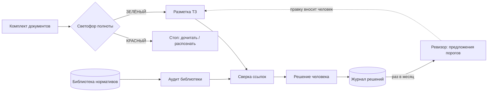

# Агенты проверки документов

Пять агентов, которые проверяют комплект документов **до** того, как по нему примут решение:
всё ли прочитано, верны ли ссылки на нормативы, те ли это нормативы, что в задании наше,
а что нет, — и чему научили прошлые решения.

Выросло из рабочей системы, которая каждый день разбирает документацию госзакупок: техзадания,
сметы, проекты контрактов, нормативную базу. Здесь — вычищенное ядро без данных заказчиков
и бизнес-логики конкретной ниши. Все примеры и обозначения нормативов вымышленные.

## Зачем

Ошибки в документах дорогие не сами по себе, а потому что их находят поздно — на приёмке или после
подписанного контракта. Каждый агент закрывает один класс таких ошибок, и каждый появился после
реального случая:

| Агент | Что ловит | Откуда взялся |
|---|---|---|
| **Светофор полноты** (`gate`) | скан без текстового слоя, обрезанный PDF, файл, который не открылся | вывод «барьеров нет» был сделан по половине комплекта: PDF читался только до 25-й страницы |
| **Сверка ссылок** (`refs`) | «пункт 6.4.9 ГОСТ…», которого в ГОСТе нет | в томе ~200 ссылок, опечатка в номере пункта — повод снять работу на приёмке |
| **Аудит библиотеки** (`norms`) | файл с нужным номером, а внутри другой документ; первоначальная редакция вместо действующей | постановление с тем же номером оказалось правилами совсем другой области |
| **Разметка ТЗ** (`clauses`) | пункты задания не своего профиля (полевые работы, лаборатория, лицензия) до того, как названа цена | обещали объём, не открыв задание |
| **Журнал решений и ревизор** (`review`) | систематическую ошибку прогноза по сегменту, пропущенные зря возможности | глубину ценовой борьбы узнавали после подачи, четыре раза подряд |

## Как устроено



Три принципа, общие для всех агентов:

1. **Считается то, что НЕ прочитано.** «Текста нет» и «документ пустой» — разные вещи. Каждый файл несёт статус
   и причину; неподдерживаемый формат — тоже проблема, а не повод его пропустить.
2. **«Не проверено» ≠ «верно».** Если текста норматива нет, ссылка помечается как непроверяемая, а не как верная.
3. **Агент предлагает, человек решает.** Ревизор находит смещение прогноза и пишет предложение — порог он не меняет.

## Запуск

```bash
pip install -r requirements.txt          # одна зависимость: pypdf
pip install -r requirements-dev.txt      # для примеров и тестов
python examples/make_examples.py         # учебный комплект в examples/

python -m dva gate examples/kit
python -m dva refs examples/kit/tz.docx --library examples/library
python -m dva norms --registry examples/registry.json --library examples/library
python -m dva clauses examples/kit/tz.docx --rules examples/rules.json
python -m dva review examples/journal.jsonl
```

Код возврата пригоден для CI и cron: `gate` — 0 зелёный, 1 жёлтый, 2 красный; `refs` и `norms` — 1, если есть ошибки.

## Что выводят

```text
$ python -m dva gate examples/kit
🔴 КРАСНЫЙ: документов 2, проблемных 1
  НЕ ПРОЧИТАН smeta_scan.pdf — PDF без текстового слоя (скан): 1 стр. — нужно распознавание
  прочитан  tz.docx
Решение принимать нельзя: комплект неполный.

$ python -m dva refs examples/kit/tz.docx --library examples/library
Ссылок на нормативы: 5 · верных 4 · ошибочных 1 · не проверено 0
  ❌ clause 6.4.9 ГОСТ Р 90001-2024 — нет в тексте норматива · «…6. Расстановку знаков выполнить согласно пункту 6.4.9 ГОСТ Р 90001-2024.…»

$ python -m dva clauses examples/kit/tz.docx --rules examples/rules.json
Пунктов: 8 · НАШЕ: 4 · ЧУЖОЕ: 1 · ИД ЗАКАЗЧИКА: 1 · ОРГ: 1 · ПРОЧЕЕ: 1
  [НАШЕ] п. 1 Разработать проект организации движения на участке 2,4 км в соответствии с пунктом 5.2.1 Г
  [ЧУЖОЕ] п. 2 Выполнить натурное обследование участка с применением передвижной лаборатории.
  [ИД ЗАКАЗЧИКА] п. 3 Заказчик передаёт исполнителю схему участка и данные учёта интенсивности за последний год.
  …
  [ПРОЧЕЕ] п. 8 Учёт интенсивности выполнить по пункту 4.3 ОДМ 90003-2022.

$ python -m dva norms --registry examples/registry.json --library examples/library
Нормативов в реестре: 4 · в порядке 1 · требуют внимания 3
  ✅ ГОСТ Р 90001-2024
  🔴 ПОДМЕНА СП 90002.2023 — нет слов из названия: организации дорожного движения — внутри другой документ
  🟠 УСТАРЕЛО ОДМ 90003-2022 — нет изменений актуальной редакции: Изменение № 2
  ⚪ НЕТ ГОСТ Р 90004-2025 — текста в библиотеке нет

$ python -m dva review examples/journal.jsonl
Решений: 5 · с исходом 4 · без исхода 1
  Без исхода (итоги могли уже выйти): Z-105
  проекты организации движения: прогнозов 2, средняя ошибка 7.8, смещение +7.8 → ПРЕДЛОЖЕНИЕ: сдвинуть прогноз сегмента на +7.8 (вносит человек)
  Пропущено зря: Z-104 (полевые работы) → пересмотреть фильтр
```

## Агенты для Claude Code

В `claude/` — то, как эти инструменты подключаются к Claude Code: определение субагента-проверяющего
и навыки (skills) с правилами приёмки. Субагент запускает агентов по порядку, не делает вывод при красном
светофоре и возвращает отчёт со ссылками на пункты, а не пересказ.

- [`claude/agents/doc-verifier.md`](claude/agents/doc-verifier.md) — субагент проверки комплекта
- [`claude/skills/revizor/SKILL.md`](claude/skills/revizor/SKILL.md) — месячная ревизия по журналу решений

## Безопасность

Документы приходят снаружи, поэтому парсер исходит из того, что файл может быть враждебным:

- XML внутри `.docx` разбирается через `defusedxml`: DTD, сущности и внешние ссылки запрещены самим парсером (XXE, «billion laughs», в том числе в UTF-16);
- пределы на размер файла, число частей архива, страницы и объём текста PDF;
- предел реально распакованного объёма — на каждую часть `.docx` и на все вместе (zip-бомба; размеру из заголовка архива не верим);
- любая ошибка чтения — статус «не прочитан» с причиной, а не падение проверки всего комплекта;
- никаких сетевых запросов, секретов и внешних сервисов: всё работает локально.

Подробнее — [SECURITY.md](../../SECURITY.md).

## Тесты

```bash
python -m pytest -q
```

Тесты собирают документы на лету: скан без текста, PDF с пустыми страницами, `.docx` с сущностями и zip-бомбой,
таблицы и сноски Word, ложные совпадения номеров пунктов («5.2.1» внутри «5.2.10»), «Срок» против «СРО».

← [К общему обзору](../../README.md)
