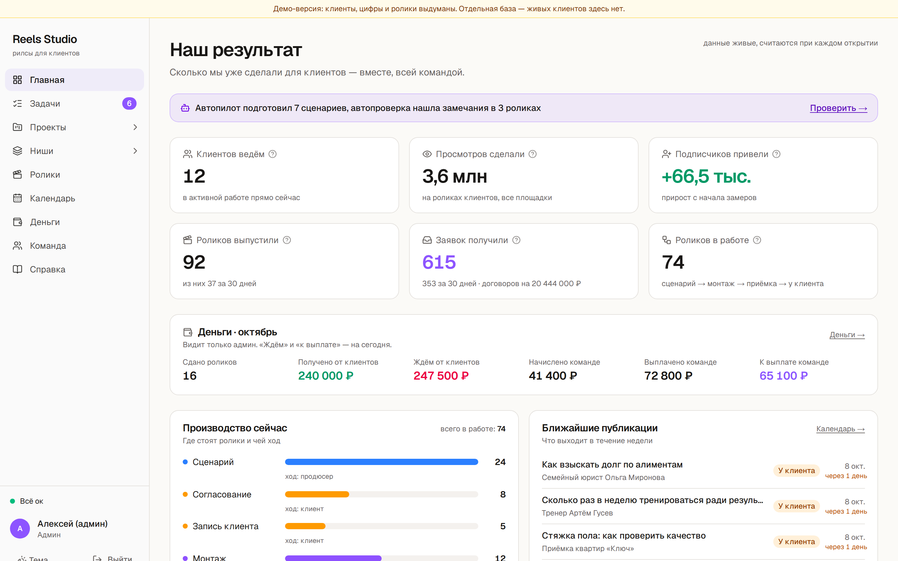
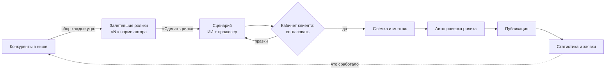
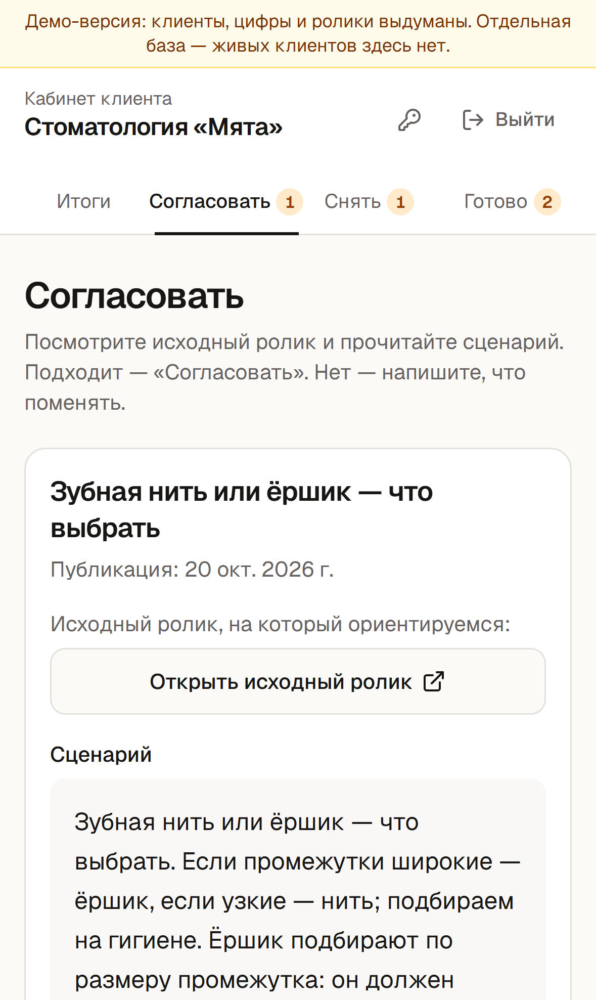
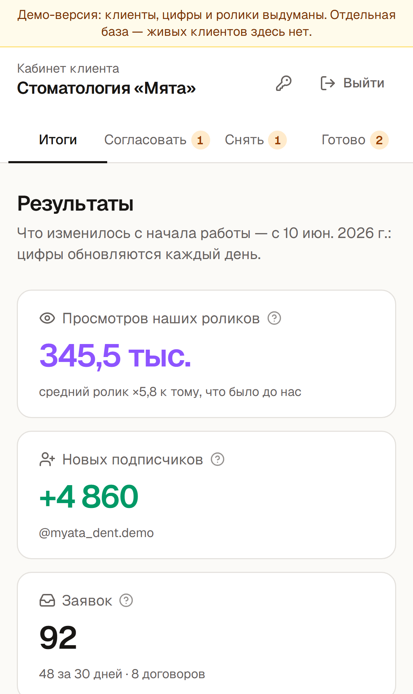
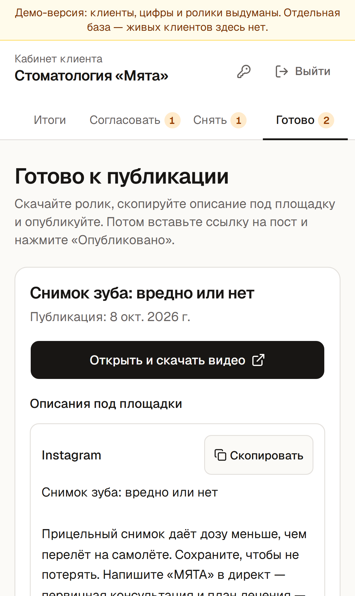
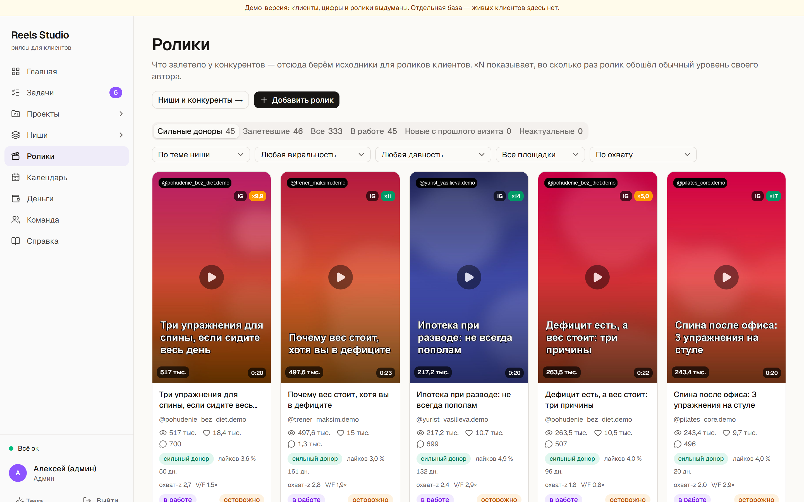
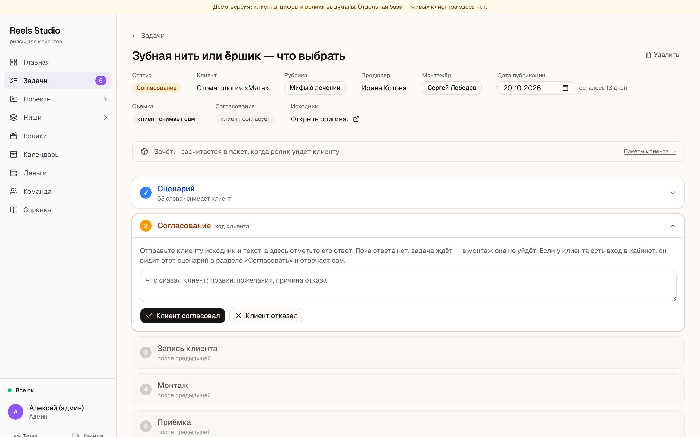
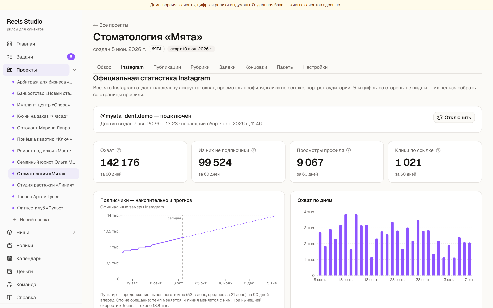
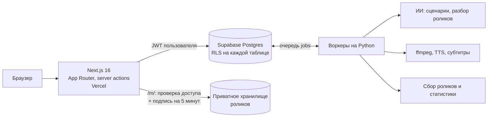

# Reels Studio

**Система ведения SMM-клиентов: от залетевшего ролика конкурента до заявки клиента.**
Команда видит конвейер роликов по всем клиентам, а у каждого клиента — свой личный кабинет,
где он следит за прогрессом, согласует сценарии и вносит правки.

[**Открыть демо →**](https://reels-studio-demo.vercel.app) · доступ к демо-учёткам — в Telegram [@probudivshiysya](https://t.me/probudivshiysya)

> Описание, скриншоты и модель безопасности. Код закрыт — боевая версия работает
> с реальными клиентами. Демо — отдельная копия на своей базе: 12 выдуманных клиентов,
> нарисованные цифры, ни одной записи из боевой системы.

## Что делает

1. **Поиск того, что уже сработало.** Система каждый день собирает ролики конкурентов в нише клиента
   и считает, во сколько раз ролик обогнал обычный уровень своего автора (**×N**). Залётом считается
   не «много просмотров», а «много для этого автора» — так находятся темы, а не большие аккаунты.
2. **Сценарий по теме клиента.** Из ролика-донора ИИ пишет два варианта сценария под рубрику
   и голос клиента; продюсер правит и отправляет на согласование.
3. **Согласование в кабинете.** Клиент видит сценарий, соглашается или возвращает с комментарием.
   Команда получает решение сразу, без переписки в мессенджерах.
4. **Монтаж и автопроверка.** До того как ролик увидит клиент, система проверяет громкость (LUFS),
   длительность и разрешение и сверяет речь с утверждённым текстом (Whisper). Слова с рискованным
   ударением выписывает отдельно — их слушает человек.
5. **Результат в цифрах.** Публикации, просмотры, подписчики, заявки и договоры — по каждому клиенту
   и по агентству в целом. Статистика Instagram подключается по токену; токен в браузер не возвращается.

## Личный кабинет клиента

У каждого клиента свой вход и свой кабинет — он видит только свой проект.

| Раздел | Что там |
|---|---|
| **Согласовать** | сценарий и ролик-донор, на который ориентируемся: «Согласовать» или «Отправить на доработку» с комментарием, что поменять |
| **Снять** | утверждённый текст для съёмки (копируется одной кнопкой) и отправка записи — она сразу уходит в монтаж |
| **Готово** | смонтированные ролики с описаниями под каждую площадку; клиент вставляет ссылку на пост — публикация отмечена |
| **Результаты** | что изменилось с начала работы: просмотры, подписчики, заявки, лучшие ролики, лента последних изменений |

Клиенту не нужно спрашивать «как там мой ролик» — стадия каждого ролика видна в кабинете,
а каждое его решение попадает команде в задачу.

  
  
  

## Для команды

- **Роли:** админ, продюсер, монтажёр, клиент. Каждая роль видит и может ровно своё:
  монтажёр не подключает статистику и не создаёт задачи, клиент не видит рабочие разделы.
- **Задачи по стадиям:** сценарий → согласование → съёмка → монтаж → проверка → у клиента → опубликовано;
  просроченные подсвечиваются, у каждой задачи — обсуждение и история.
- **Ниши и конкуренты:** ревью найденных аккаунтов, отсев роликов не по теме, карточка донора с разбором.
- **Календарь и автопилот:** свободные дни по рубрикам, автоподбор донора на свободный день.
- **Деньги:** пакеты клиентов, начисления команде по дате передачи ролика.

## Как устроено

| Слой | Технологии |
|---|---|
| Интерфейс | Next.js 16, React 19, TypeScript, Tailwind 4, shadcn/ui, Recharts |
| Данные | Supabase: Postgres, Row Level Security, Auth, Storage; 16 миграций |
| Фон | очередь заданий в Postgres, воркеры на Python (сбор, ИИ, монтажные утилиты), cron |
| Размер | 31 страница, ~22 тыс. строк TypeScript |

## Безопасность

Систему проверяли как чужую: независимые агенты (Claude, Qwen, DeepSeek) получали учётки каждой роли
и задачу выкачать чужие данные, повысить себе права или подделать цифры. Шесть кругов атаки, после каждого — исправление
и перепроверка, пока круг не возвращался пустым. Каждый коммит дополнительно проходит автоматическую проверку
безопасности, а 32 атаки на права повторяет автотест прямо в базе — под каждой ролью, с откатом транзакции.

| Угроза | Защита |
|---|---|
| Клиент читает чужой проект через API | RLS на каждой таблице; клиенту — только представления `kabinet_*` с `security_barrier`, только чтение |
| Повышение роли через свой профиль | триггер на `profiles`: роль и проект меняет только админ |
| Монтажёр правит чужое через API базы | монтажёр меняет только свою задачу, только на монтаже и приёмке и только поля монтажа; заявки, цифры и проекты пишут только продюсер и админ |
| Обход прав через фоновые задания | задания выполняет система с полными правами, поэтому кто какое задание и на чью задачу ставит, проверяется при постановке в очередь |
| Вход без роли | рабочие таблицы открыты только команде: пользователь без профиля не видит ничего |
| Запись в статистику в обход интерфейса | у ролей сайта отозваны `insert/update/delete` на таблицах статистики; запись — только через функцию с проверкой роли |
| Скачивание чужого ролика по ссылке | хранилище приватное; `/m/…` сверяет полный адрес ролика с правами пользователя и отдаёт подписанную ссылку на 5 минут |
| Подмена Host и `_`/`%` в адресе | адрес сайта берётся из настроек, не из запроса; сравнение точное, без `LIKE` |
| Утечка токена Instagram | токен хранится на сервере, в HTML и ответах его нет; поле ввода скрытое |
| XSS через поля клиента | React-экранирование, CSP, `X-Frame-Options: DENY`, `nosniff` |
| Лишние пути к данным | GraphQL-схема закрыта; у `security definer`-функций `pg_temp` в конце `search_path` |

← [К общему обзору](../README.md)
